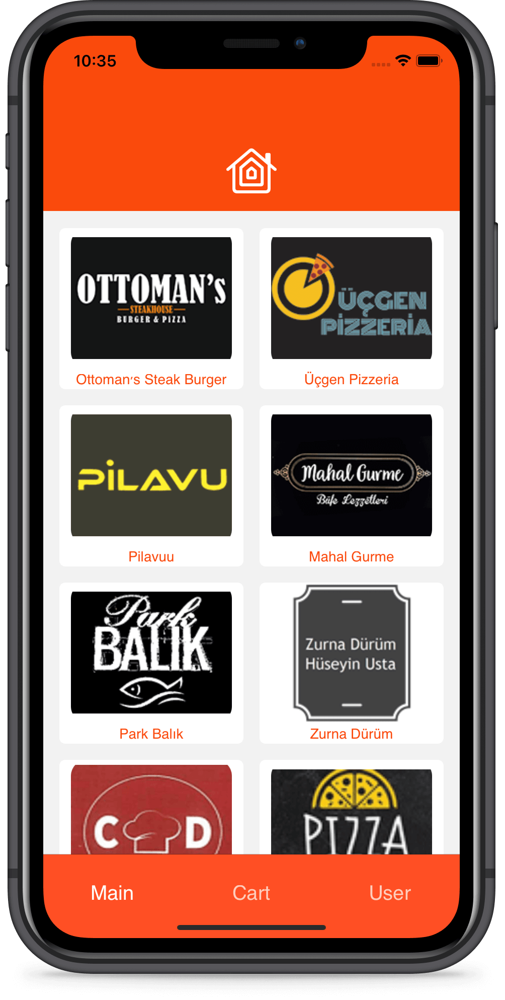

# 
Food Delivery Frontend

## What is Food Delivery?

Retail food delivery is a courier service in which a restaurant, store, or independent food-delivery company delivers food to a customer. An order is typically made either through a restaurant or grocer's website or mobile app, or through a food ordering company. The delivered items can include entrees, sides, drinks, desserts, or grocery items and are typically delivered in boxes or bags. The delivery person will normally drive a car, but in bigger cities where homes and restaurants are closer together, they may use bikes or motorized scooters. Recently, we have also seen the use of autonomous vehicles by companies like Starship Technologies, currently available in the USA and the UK to complete deliveries.

## Project Details

This repository contains the frontend part of the Food Delivery Project. In this part of the project, a dump JSON data is used to simulate the shopping. Food Delivery App follows the Model View Controller (MVC) design pattern. The project has been written solely in Swift Language.

## 
Screenshoots

